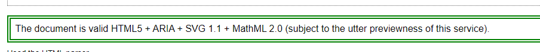
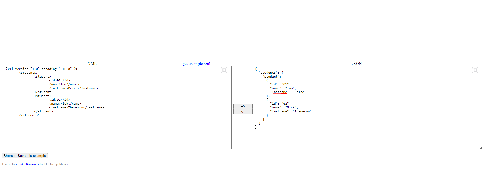
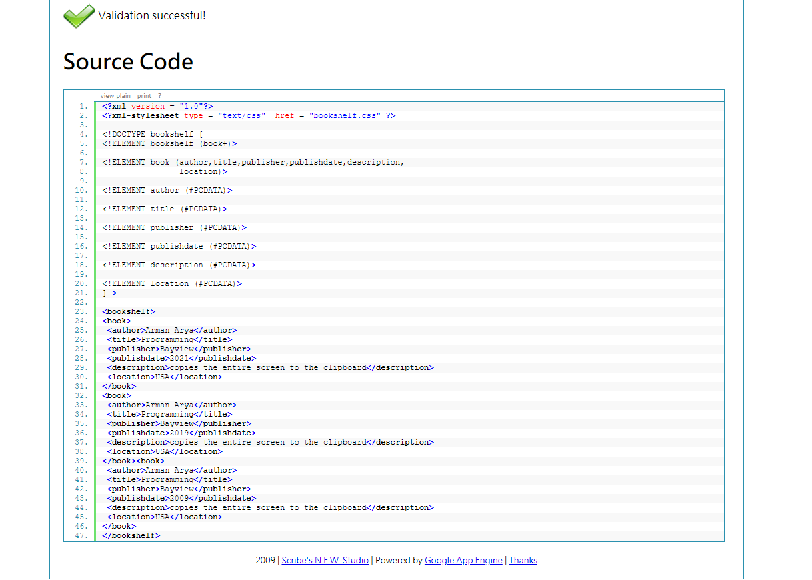
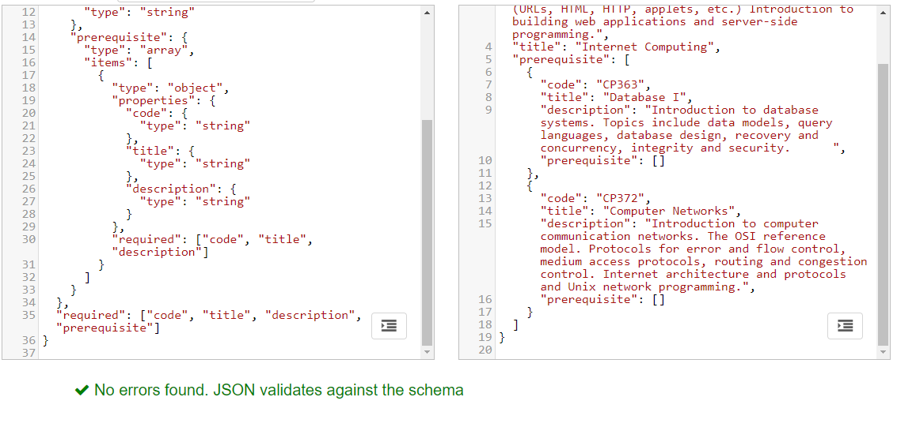

# A1 Report

Author: Arman Aryanpour

Date: 1/20/2021

## T1 XAMPP & Utilities

### T1.1 XAMPP

Complete (Yes/No) **yes**

If Yes, include (link) the screen shot image as following using `` to prove completion, and/or add a link to the question solution if applicable.
**Not applicable**

### T1.2 Utility programs

Complete (Yes/No)? **yes**

If Yes, include (link) the screen shot image as following using `` to prove completion, and/or add a link to the question solution if applicable.

**Not applicable**

## T2 HTML & CSS & Markdown

### T2.1 HTML basic

Complete (Yes/No)? **yes**

If Yes, include (link) the screen shot image as following using `` to prove completion, and/or add a link to the question solution if applicable.

### T2.2 CSS

Complete (Yes/No)? **yes**

If Yes, include (link) the screen shot image as following using `` to prove completion, and/or add a link to the question solution if applicable.

**Not applicable**

### T2.3 Markdown

Complete (Yes/No)? **yes**

If Yes, include (link) the screen shot image as following using `` to prove completion, and/or add a link to the question solution if applicable.

**Solution is in examples/html**

## T3 XML & JSON

### T3.1 XML & DTD

Complete (Yes/No)? **yes**

If Yes, include (link) the screen shot image as following using `` to prove completion, and/or add a link to the question solution if applicable.

### T3.2 XML & XSL & XSD

Complete (Yes/No)? **yes**

If Yes, include (link) the screen shot image as following using `` to prove completion, and/or add a link to the question solution if applicable.

### T3.3 JSON

Complete (Yes/No)? **yes**

If Yes, include (link) the screen shot image as following using `` to prove completion, and/or add a link to the question solution if applicable.

## Q1 HTML & CSS project

### Q1.1 HTML myindex.html

Complete (Yes/No)? **yes**

If Yes, include (link) the screen shot image as following using `` to prove completion, and/or add a link to the question solution if applicable.

[Solution](q1/myindex.html)

If No, add a short description to describe the issues encountered.

### Q1.2 CSS mystyle.css

Complete (Yes/No)? **yes**

If Yes, include (link) the screen shot image as following using `` to prove completion, and/or add a link to the question solution if applicable.
**Not applicable**

### Q1.3 HTML validation

Complete (Yes/No)? **yes**

If Yes, include (link) the screen shot image as following using `` to prove completion, and/or add a link to the question solution if applicable.

## Q2 XML bookshelf project

### Q2.1 DTD bookshelf.dtd

Complete (Yes/No)? **yes**

If Yes, include (link) the screen shot image as following using `` to prove completion, and/or add a link to the question solution if applicable.

**Not applicable**

### Q2.2 XML mybookshelf.xml

Complete (Yes/No)? **yes**

If Yes, include (link) the screen shot image as following using `` to prove completion, and/or add a link to the question solution if applicable.

**Not applicable**

### Q2.3 CSS bookshelf.css

Complete (Yes/No)? **yes**

If Yes, include (link) the screen shot image as following using `` to prove completion, and/or add a link to the question solution if applicable.

[Solution](q2/mybookshelf_css.xml)

### Q2.4 XML & DTD validation

Complete (Yes/No)? **yes**

### Q2.5 XSLT bookshelf.xsd

Complete (Yes/No)? **yes**

If Yes, include (link) the screen shot image as following using `` to prove completion, and/or add a link to the question solution if applicable.

## Q3 JSON course project

### Q3.1 JSON scheme course_schema.json

Complete (Yes/No)? **yes**

If Yes, include (link) the screen shot image as following using `` to prove completion, and/or add a link to the question solution if applicable.

[Q3.1](q3/course.json)

### Q3.2 JSON course.json

Complete (Yes/No)? **yes**

If Yes, include (link) the screen shot image as following using `` to prove completion, and/or add a link to the question solution if applicable.

**References**

1. [HBF, CP476 Assignment 1](a1.html)
2. Add your references used in developing your solutions.
